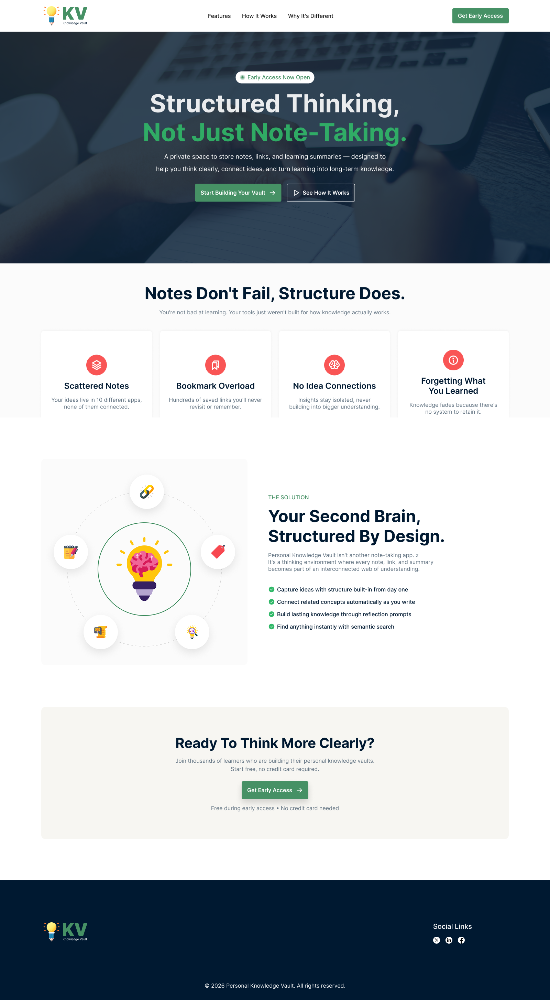

# 🧠 Personal Knowledge Vault

**Structured Thinking, Not Just Note-Taking.**

Personal Knowledge Vault is a modern, responsive landing page for a private space designed to store notes, links, and learning summaries. It helps users think clearly, connect ideas, and turn learning into long-term knowledge.


## 🚀 Live Demo

- [Visit Live Site](https://redwanhossain200.github.io/B13-A01/)

## ✨ Key Features

- **Structured Note-Taking:** Go beyond simple text. Organize your thoughts in a way that builds a "Second Brain".
- **Idea Connection:** Connect related concepts automatically as you write to build an interconnected web of understanding.
- **Bookmark Management:** No more bookmark overload. Save links with context and purpose.
- **Semantic Search:** Find anything instantly within your vault using advanced search capabilities.
- **Mobile Responsive:** Fully optimized for all screen sizes, from large desktops to small mobile phones.
- **Premium Aesthetics:** Clean, modern design featuring glassmorphism, smooth gradients, and micro-interactions.

## 🛠️ Technologies Used

- **HTML5:** Semantic structure for SEO and accessibility.
- **Vanilla CSS:** Custom-built design system with responsive layouts using Flexbox and Grid.
- **Google Fonts:** Utilizing the 'Inter' font family for a sleek, modern look.
- **Font Awesome:** Professional iconography for better visual communication.

## 📂 Project Structure

```bash
B13-A01/
├── assets/             # Project images and icons
├── UI/                 # Full UI design assets (PNG)
├── index.html          # Main web page (Entry Point)
├── style.css           # Custom CSS styling
├── KnowledgeVault.fig  # Figma design source file
└── README.md           # Project documentation
```

## 🎨 Design Assets

This project is built based on a professional design. You can find the design assets in the following locations:

- **Full Preview:** `UI/Home.png`.
- **Component Breakdowns:** Screenshots of each section are available in the `/Sections` folder for reference.

## ⚙️ How to Run Locally

1. Clone this repository or download the source code.
2. Navigate to the project directory.
3. Open `index.html` in your favorite web browser.
   - _Alternatively, use "Live Server" extension in VS Code for a better development experience._

## 🎨 Design Philosophy

- **Vibrant & Clean:** Uses a professional color palette (Success Green: `#28a745`, Dark Navy: `#001931`) to create trust and focus.
- **Interactivity:** Subtle hover effects and smooth transitions enhance the user experience.
- **Typography:** prioritized readability with structured heading hierarchies.

---


